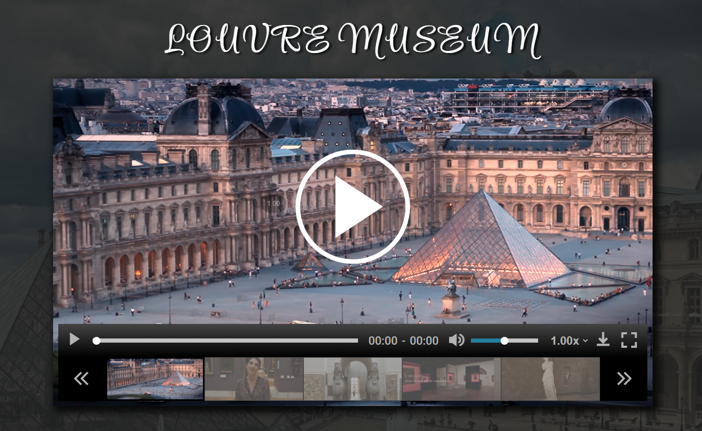

# custom-video-player

```
RS School. JavaScript/Front-end 2021Q3. Stage#0
```

## Description task: [js-30](https://github.com/rolling-scopes-school/tasks/blob/master/tasks/js30/js30.md), [custom-video-player](https://github.com/rolling-scopes-school/tasks/blob/master/tasks/js30/js30-4.md)

