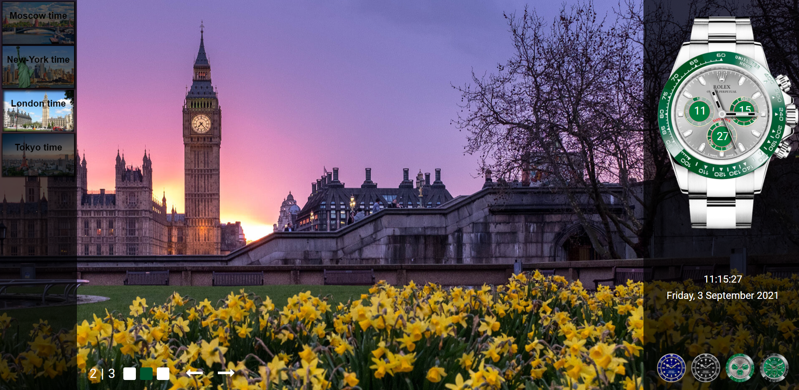

# js-clock

```
RS School. JavaScript/Front-end 2021Q3. Stage#0
```

## Description task: [js-30](https://github.com/rolling-scopes-school/tasks/blob/master/tasks/js30/js30.md), [js-clock](https://github.com/rolling-scopes-school/tasks/blob/master/tasks/js30/js30-2.md)

## Demo: [JS-CLOCK](https://volkovva.github.io/js-clock/)

